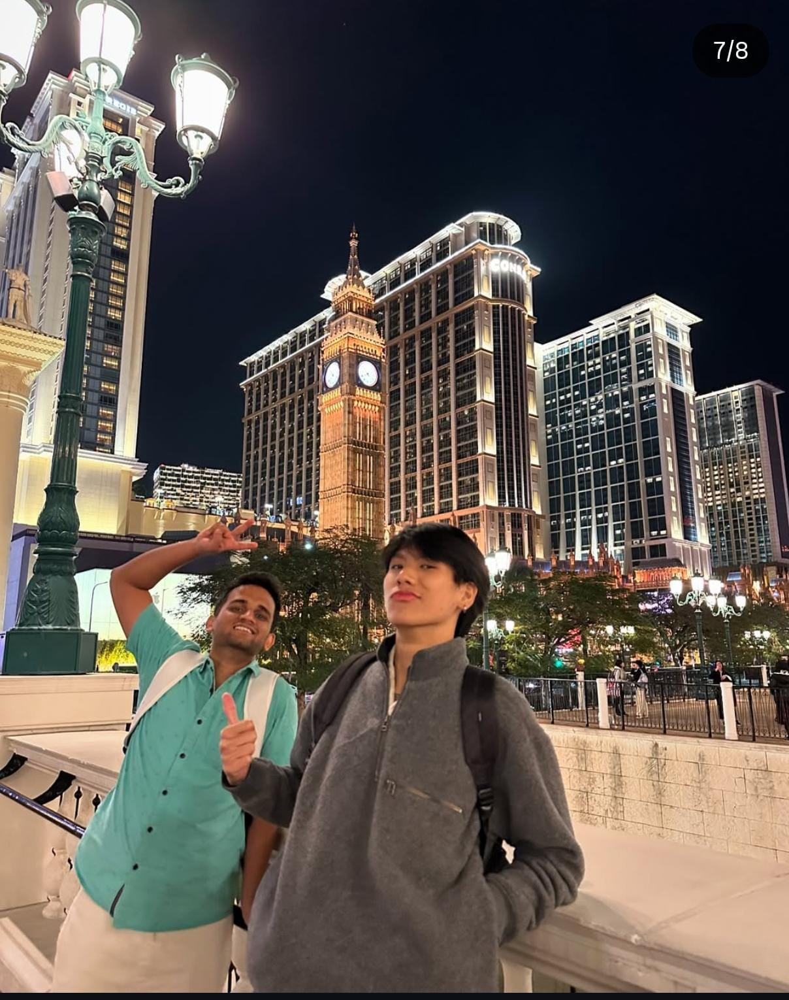

# Day 2 — Macau

> **Theme:** The conference brought us together. Macau gave us memories.

# The City That Didn't Go According to Plan

The conference was finally over.

No presentations.

No rehearsing.

No checking my slides every five minutes.

For the first time since arriving in Hong Kong, I could simply enjoy the trip.

A group of us decided to spend the day exploring Macau before everyone headed back home.

By then, we'd stopped being "conference delegates."

We were just a bunch of friends wandering around another country together.

---

# My Casino Dream Lasted Exactly Thirty Seconds

If there was one place I wanted to visit in Macau, it was a casino.

Not because I wanted to gamble.

I'd simply never seen one from the inside.

Movies make casinos look magical—bright lights, poker tables, people dressed in suits, chandeliers hanging from the ceiling.

I just wanted to see what all the hype was about.

So naturally...

I was the first person standing in line.

Passport in hand.

Confidence at an all-time high.

The security guard looked at my passport.

Looked at me.

Looked back at my passport.

Then smiled.

> "You're nine months too early."

For a second, I genuinely thought he was joking.

He wasn't.

Turns out, the legal gambling age in Macau is 21.

I was still 20.

Nine months.

I'd travelled all the way to Macau only to lose to Nine months.

Everyone else went inside.

I couldn't exactly say,

> "Guys, nobody goes inside because I'm underage."

So I smiled, told them to enjoy themselves, and decided to explore the city on my own.

Looking back...

I'm glad things happened that way.

---

# The Best Part Was Outside

For the next couple of hours, Macau became my playground.

I had nowhere to be.

No timetable to follow.

No presentation waiting for me.

I just walked.

Every street looked expensive.

Designer stores lined almost every corner.

Ferraris and Lamborghinis casually drove past like they were ordinary cars.

Hotels looked less like hotels and more like palaces.

Coming from Bangalore, it almost felt surreal.

I probably walked much farther than I realised.

Sometimes I'd stop just to admire a building.

Sometimes I'd wander into a shopping street with no intention of buying anything.

Sometimes I'd simply sit for a few minutes and watch people walk by.

It's funny.

The thing I was most disappointed about that morning—missing out on the casino—ended up giving me some of my favourite memories from Macau.

---

# Mission Impossible

Of course...

I wasn't ready to give up that easily.

At some point, curiosity got the better of me.

> "Surely there has to be another entrance."

That single thought turned into a full-fledged mission.

I walked around the casino.

Then around it again.

I mentally mapped every entrance, every exit, and every side road.

Each time I convinced myself I'd found a way in...

I was greeted by security.

There were two guards I still remember.

One Korean.

One Pakistani.

Those two somehow knew exactly where I was heading before I did.

Every entrance.

> "No."

Another entrance.

> "No."

Another entrance.

Still no.

After a while, I had to admit defeat.

The casino had officially won.

After accepting defeat, I figured I should at least learn my way around Macau.

Unfortunately...

I had absolutely no clue where I was going.

Every five minutes I somehow ended up asking the same security guard for directions.

"How do I get there?"

"Which road leads back?"

"Is this the ferry?"

I must have annoyed him quite a bit.

Eventually...

instead of explaining it again...

he quietly pulled a tourist map out of his pocket, handed it to me and basically said,

"Here."

I don't know if he was trying to help me...

or politely asking me to stop bothering him.

Either way...

I walked away with a free map.

I couldn't enter the casino.

But I did win something.

---

# Photobombing Boom

Eventually I found everyone again.

By then...

the serious conference atmosphere had completely disappeared.

Everyone was taking pictures.

Boom, in particular, somehow looked like he belonged in every single photograph.

Before meeting Boom...

back in Bangalore, I used to go around confidently claiming I was *the pinnacle of male evolution.*

Then I met him.

I quickly learnt my place.

Fortunately...

Boom turned out to be one of those people who never took himself too seriously.

Some people get annoyed when you ruin their photos.

Boom practically encouraged it.

So naturally...

I accepted the challenge.

Every time someone pointed a camera at him...

I'd quietly appear somewhere in the background.

Sometimes making a weird face.

Sometimes pretending not to notice the camera.

Sometimes striking the most ridiculous pose I could think of.

The best part?

Boom never got annoyed.

He'd just laugh...

and let me continue ruining perfectly good photos.

Looking back at those pictures now...

I wouldn't change a single one.

---

# Leaving Macau

As the sun slowly began to set...

it was time to head back to Hong Kong.

By then...

everyone was exhausted.

We'd spent the entire day walking through Macau.

Taking pictures.

Getting rejected by casinos.

Laughing at my failed infiltration attempts.

All we wanted now...

was to get back to Hong Kong.

That's when I noticed something I'd never seen before.

Massive shuttle buses.

And I mean massive.

Back home...

I'd probably pay a few thousand rupees to travel in a coach that size.

Here...

they were completely free.

Apparently the casinos operated shuttle buses between their resorts and the port authority.

For free.

I still don't know how that business model works.

# The Wrong Bus

Everyone was tired.

Too tired to think.

Too tired to argue.

As we walked towards one of the buses...

Yuchen suddenly walked over to one of the transport staff and started speaking in Mandarin.

I had absolutely no idea what either of them were saying.

So I did the only useful thing I could do.

I looked up.

Right at the destination board on the front of the bus.

Thankfully...

it was in English.

I read it once.

Then again.

Something didn't seem right.

One of the professors later joked that I was having an existential crisis.

Honestly...

he wasn't wrong.

This bus wasn't going where we wanted to go.

Meanwhile...

Yuchen was still confidently talking to one of the transport staff.

I tried explaining that I thought we were about to board the wrong bus.

She wasn't convinced.

Neither was the transport staff.

The funny part?

Yuchen understood English.

The staff member didn't.

So for the next minute or so...

the three of us somehow managed to have an argument despite none of us speaking a common language fluently.

Eventually...

I pulled out Google Translate.

Between the translations...

the destination board...

and a lot of pointing...

we finally figured it out.

We were, in fact...

standing in front of the wrong bus.

A few minutes later...

we found the correct shuttle.

Everyone quietly climbed aboard.

Nobody had enough energy left to celebrate being right.

After making sure we were finally on the right bus...

we headed towards the port.

From there...

we boarded another coach for Hong Kong.

A perfectly ordinary-looking bus.

Or so I thought.

A little while later...

it started driving...

into the sea.

Now...

I know it wasn't actually driving through the ocean.

It was driving across the Hong Kong–Zhuhai–Macau Bridge.

But from inside the bus...

it genuinely felt like we were crossing the middle of the sea.

Water stretched endlessly on both sides.

There was no land in sight.

Just a highway...

floating across the ocean.

I remember sitting by the window thinking,

> "Who wakes up one day and decides to build a bridge here?"

The journey itself almost felt unreal.

One moment we were in Macau.

A little while later...

we were back in Hong Kong.

Only after coming home did I realise what we'd actually crossed.

The Hong Kong–Zhuhai–Macau Bridge.

One of the longest sea-crossing bridge systems in the world.

Looking back...

that journey was almost as memorable as Macau itself.

# Customs

After spending the day exploring Macau...

we took the bus back to Hong Kong that same night.

Everyone was tired.

The conference was over.

All we wanted to do was get back to the hotel.

Instead...

customs had other plans.

As I walked through immigration...

an officer stopped me and politely asked me to step aside.

Now...

before your imagination starts running wild...

I wasn't carrying anything suspicious.

No mysterious gadgets.

No expensive souvenirs.

No forbidden items.

Just... me.

Apparently, after a few days without shaving...

I looked just suspicious enough to deserve a closer look.

The officer led me into a waiting area.

To my surprise...

I wasn't alone.

There were several other Indian travellers sitting there.

Almost all of them had impressive beards.

I remember looking around and thinking...

"Well... I guess I've found my people."

After a while...

they called my name.

Then came the backpack inspection.

Every compartment.

Every zipper.

Every tiny pocket.

They searched it so thoroughly...

I was convinced they'd organise my bag better than I ever had.

The grand discovery?

A laptop.

Some chargers.

A couple of hundred Hong Kong dollars.

That was it.

The officer smiled...

handed everything back...

and wished me a pleasant evening.

As it turns out...

I wasn't suspicious.

I was just slightly too bearded for a day trip to Macau.

By the time I finally caught up with everyone else...

they'd already made themselves comfortable waiting for me.

Naturally...

they found the whole story much funnier than I did.

*Not exactly how I'd imagined ending my first trip to Macau... but it certainly made for a memorable story.*

# The Reveal I Never Saw Coming

The trip came to an end.

The Thai group flew back home the next morning.

Yuchen stayed back in Hong Kong for another day to meet an old friend from China.

A few days later, after everyone had reached home safely, I suddenly realised something.

I never asked Boom for his Instagram.

So I messaged Yuchen.

> "Hey, do you have Boom's Instagram?"

She sent me his profile.

I opened it.

Scrolled once.

Scrolled again.

Then I just stared at my phone.

Boom...

the same Boom I'd met at a random bus stop.

The same Boom I'd had breakfast with.

The same Boom whose photos I'd spent an entire day photobombing...

...was a Vogue model.

Suddenly every single picture from the trip made sense.

The effortless smile.

The perfect posture.

The fact that he somehow looked good even in the photos I was trying my hardest to ruin.

The funniest part?

Nobody had mentioned it during the trip.

Not once.

And honestly...

I'm glad.

Because I got to know Boom as Boom.

Not as "the Vogue model."

Looking back...

I don't remember Boom as the Vogue model.

I remember the guy who smiled at me at a random bus stop.

The guy who laughed through breakfast.

The guy who got kicked out of our cab.

The guy whose pictures I kept photobombing.

Finding out he modelled for Vogue afterwards was hilarious.

But I'm glad I found out afterwards.

Because for those two days...

he was simply Boom.